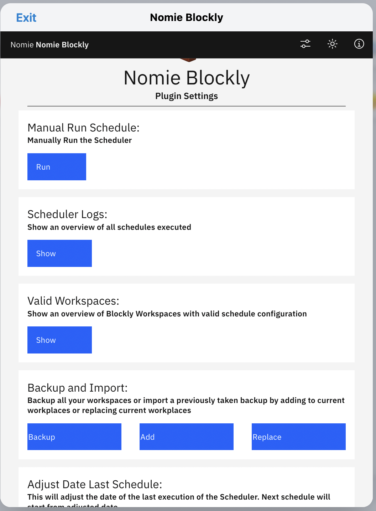

# 🧱Nomie Blockly Plugin

The 🧱Nomie Blockly Plugin is a plugin for Nomie6-oss.

## About the 🧱Nomie Blockly Plugin

The Nomie Blockly plugin allows you extend the Nomie app with your own code which you can develop using Blockly, a library for building block programming apps.

Block programming allows users to create scripts and programs by using
visual blocks, even if they do not know any programming language.

Blockly includes everything you need for defining and rendering blocks in a drag-n-drop editor. Each block represents a chunk of code that can be easily stacked and translated into code.

## Installing the Plugin

The url of the plugin is:

[https://dailynomie.github.io/nomie-blockly-api/](https://dailynomie.github.io/nomie-blockly-api/)

The 🧱Nomie Blockly Plugin can be installed in Nomie via the following steps:

* Go to the More Tab
* Select Plugins
* Click the + or Add Custom Plugin
* Provide the url for the plugin
* Tap Install Plugin

## What is Blockly

Blockly is a project developed by Google which presents long, text-based code strings in visual blocks. These blocks can be assembled using drag and drop. This allows you to create a complex syntax in a matter of
minutes. Blockly is a library that provides a **visual code editor** .
The syntax of the programs created in this way remains in thebackground. Anyone working with Blockly can easily create complexprocesses without thinking about the exact commands of the individual programming languages.

## What can Blockly add to Nomie

With the 🧱Nomie Blockly Plugin you can easily create your own piece of code by dragging and dropping blocks. The plugin includes specific blocks to interact with Nomie. It enables you to pull data from Nomie which you can use -for example- to execute calculations. The result of these calculations can then pushed back to Nomie via a specific block which will push a log/note to Nomie.

The possibilities are endless, but some usecases which you can quickly visually build are:

* Pull the last 30 days of the amount of sleep. Calculate the average and push back the average amount of sleep from the last 30 days. When you do this everyday you build 30days average sleep datapoints in Nomie.
* Get the actual temperarture from the city where you live by using a public available API and push the data to Nomie

The 🧱Nomie Blockly Plugin also includes a 'Scheduler' which will enable you to schedule the execution of the code you created automatically in the background on a daily base. This is very useful for both above mentioned usecases. For more information about the Scheduler function, please read on as there is a specific section with information available about this capability.

## Blockly Example

Using the blocks is really intuitive. Simply open a category and drag the desired code block to the **working areausing the mouse. The individual blocks can also be adjusted and combined with others. If a combination isn’t possible, the block will not snap into place and will also not be included in the source text.
Individual puzzle pieces or groups of associated blocks can easily be deleted from the working area again. In that case, the corresponding lines of code are removed in the source text.

To create a capability which gets the current temperature and stores it in Nomie, you just have to drag and drop blocks as per below:

## How to use the 🧱Nomie Blockly Plugin

After launching the plugin you will be presented with an overview off all the workspaces you created. Initially no workspaces are shown as you did not create one:

Clicking the + button will give you the option to create a new Blockly workspace. You can either choose a predefined workspace (like the temperature example) or use the Kick Start for an empty workspace.

## The workspace

Let's assume you have choosen the Kick start option, you will be presented with the following screen:

You can remove the starter 'Meaning of Life' blocks or start experimenting with these blocks.

At the top of the screen you see some icons. These have the following functions:

* The disk icon let's you save the current workspace
* The Monitor/terminal icons will expand a small terminal view, handy for simple debugging
* The Arrow Up icon will let you save the current workspace to your local device as a json file.
* The Arrow Down icon will let you import a previously saved workspace.

The last to options gives you the opportunity to share workspaces with other Nomie users!

### The Blocks

At the bottom of the screen you will find the available blocks. In addition to the standard blocks which comes with Blockly, I have added additional sets of blocks:

* Nomie: Let's you interact with the Nomie app. You can pull data from Nomie trackers and push data back into Nomie. It also includes a block to interact with external API's in order to retreive external data (like the temperature example)
* Objects: most data received from external API's are delivered in a specific json object format. The object blocks let's you easily handle this data
* Functions: advanced users can even create functions as per regular program language functionality. This advanced usage is absolutely not needed when you want to do basic data handling.
* Advanced js: these are even more advanced javascript functions. For those who want to go all the way with Blockly.

### The specific Nomie Blocks

The following blocks are available:

* Wrapper/Scheduler: you should 'wrap' all your code in this wrapper in order to enable the interaction between the Blockly code and the Nomie app. You can also use this wrapper to 'schedule' the execution of the code on your workspace at regular timeslots. this will enable you to execute the code for instance daily. Usefull for the temperature example....
* Fetch Day Value: this will pull the value of a specific tracker on a specific day.
* Fetch Period Value: this will pull the statistics for a specific tracker or searchterm for a given period (last 7days, last 30days etc)
* Log Value for Tracker: this will log a specific value for a tracker on a given day in Nomie
* Push to Console: remember the 'monitor' icon at the top of the screen? Clicking that icon will expand a small console. With the push to console block you can push messages to this console. Handy for debugging your blockly stack.
* Push to web Console: every modern browser has the option to open a console which gives the option to debug your webpage code. This block will push messages to your browser console.
* Wait: sometimes you just want the execution of your code to pauze between 2 blocks. This block will make that happen.
* Statistics: when pulling data from Nomie it is handy to indicate which data to pull for a certain tracker/period combination. The options are: Sum, Average, Maximum or Minimum value.
* Day: this will indicate which day to use when pushing and pulling data. The options are Today or Yesterday. This block is specifically usefull when using the Scheduler to execute your workspace code as this block is always relative to the day the code is executed.
* Date: this block will give the option to provide an absolute date. For instance for pulling or pushing data to Nomie
* Period: this block let's you indicate a certain period. Mainly used for pulling data from nomie
* T(rackables): a list of Nomie Trackables used in the last 30 days. This block is used to indicate for which Trackable data needs to be pushed or pulled from Nomie
* Fetch API data: this is a block to get data from external API's. See the temperature example how you can use this block.

### The code

Now that you have a view on the workspace and the available blocks, it's time to start stacking blocks and create some code. Some important guidelines:

* Do not forget to wrap your blocks in the dark blue Nomie wrapper block
* Do not forget to save your code regular with the save button
* You can debug your code with the console

In below example I have created a stack of blocks which will retrieve the occurance for a certain term within the Nomie logs for the last 30 days.

I have included 2 'wait' blocks which slows down the execution so you can follow each step.

The result will be shown in a dialogue block in this example, but you can also t=use the result to do some calculations or to store the value in a specific Nomie Trackable.

As you can see I also expanded the console and included a 'Push to console' block to log some messages to the console.

Once you have finsihed stacking your blocks and saved your workspace, you can execute the code with the 'arrow' button at the top right of the screen.

## Edit Single Workspace Settings

You can edit the settings of a Single Workspace by clicking the edit icon for the Workspace you would like to edit:

### The Workspace Editor

Once you have clicked the edit icon you will be directed to the Workspace Editor:

Most of the options are obvious, I would like to highlight some specific options:

* Latest Run: this is the date that this specific Workspace has been executed as part of the Scheduler (see further in the documentation for details about the Scheduler function). You can adjust this date so that the scheduler will pick up from an alternative date.
* Single Manual itterated Run: You can simulate the scheduler for this specific Workspace for a specifc timeframe. Please make sure that you understand the Scheduler capability first before experimenting with this option.

## Execute Workspace from Trackable

It is possible to execute a workspace by clicking a trackable. Let's take above example as our starting point. Remember we called the workspace 'Retrieve Statistics Example'.

If we create a new tally trackable and use the 'more options' settings of the trackable to include the text: 'Run Blockly Workspace: Retrieve Statistics Example', our workspace will be execute each time the trackable is clicked. See below how it works:

## The Scheduler

The 🧱Nomie Blockly Plugin has the option to execute selected workspaces automatically each day. The plugin will use a 24 hours interval and will 'catch up' if Nomie was not used for longer then 24 hours. For example, if after the last schedule execution Nomie was not used for 4 days, the first time Nomie will be started again, the scheduler will run 4 times, each with a different reference day. This is usefull for workspaces with code which will push data to Nomie on a daily base (like for instance a daily temperature workspace).

You an easily select the workspaces which should be part of the scheduler by setting the Schedule option in the Nomie rapper block to 'daily':

Please be aware that the 'Day' block is relative to the date the scheduler is pretending to run. So when the scheduler is catching up for the last 4 days as in above example, the scheduler will use the 'Day' block to convert to a date relative to the date the scheduler is catcing up for.

## The Settings

The 🧱Nomie Blockly Plugin has a couple of settings you can tune. You can go to the settings screen by clicking on the settings icon at the top of the screen:

Once clicked you will see below overview:

* Manually run Schedule: you can manually run the scheduler by choosing this option.
* Scheduler Logs: This option will provide an overview of all Schedules which have been executed. After clicking the button, please scroll to the bottom of the screen where you can find the result in a console field.
* Valid Workspaces: this will provide an overview of workspaces which have the schedule option enabled. The result will be shown in the console at the bottom of the screen.
* Backup and Import: you can backup/import all your workspaces at once to your local device. This will also enable you to share with other Nomie users. Remember that you can import/export an individual workspace as an option from the the workspace screen.
* Adjust Date Last Schedule: This is an emergency option. If -for whatever reason- the scheduler failed, you can adjust the date the scheduler ran for the last time. The next time the scheduler is triggered it will take the new dat as reference/starting point.

## The 🧱Nomie Blockly Plugin Widget

This plugin comes with a simple widget which you can insatll in the Nomie Dashboard.

After installing the widget will provide you insight in:

* The last time the scheduler has been executed
* The amount of workspaces defined
* The amount of workspaces part of the scheduler

